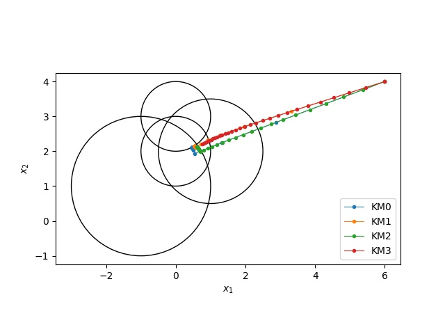
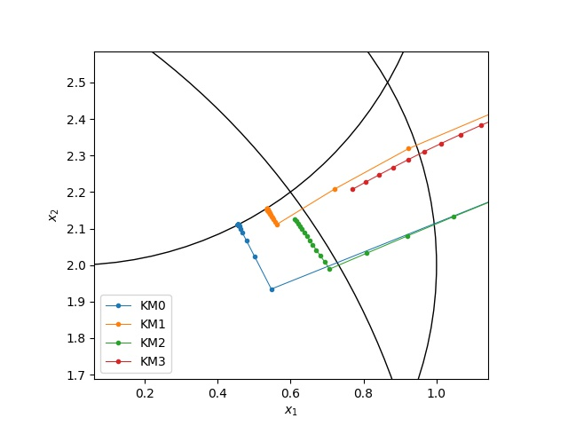

# fixed-point
Krasnoselskii-Mannアルゴリズムの実装例です。
Krasnoselskii-Mannアルゴリズムは以下のようなアルゴリズムです。ただし、Tは非拡大写像です。


## 実行方法
2次元の場合に4つの閉球への距離射影を与えた場合のサンプルプログラムを実行できます。
```
python3 src/main.py
```

サンプルプログラムで扱う非拡大写像は、各Piを閉球への距離射影として、


の二つです。
比較するアルゴリズムの詳細は、コードを参照してください。

### 実行結果
サンプルプログラムの問題の4つの閉球とKrasnoselskii-Mannアルゴリズムにより生成された点列を2次元平面に描画した結果です。



特に、解の周辺での振る舞いは以下のようになっています。


