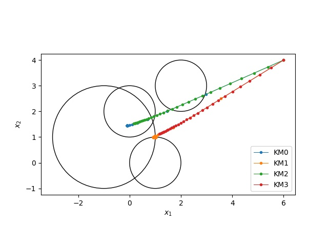
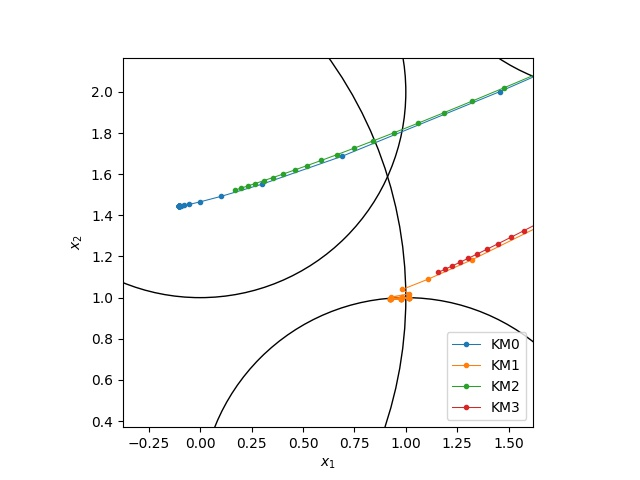

# fixed-point
Krasnosel'skii-Mannアルゴリズムの実装例です。
Krasnosel'skii-Mannアルゴリズムは以下のようなアルゴリズムです。ただし、Tは非拡大写像です。

<p align="center">
  
</p>

## 実行方法
2次元の場合に4つの閉球への距離射影を与えた場合のサンプルプログラムを実行できます。※pythonのバージョンが3.9以降である必要があります。
```
python3 src/main.py
```

サンプルプログラムで扱う非拡大写像は、各Piを閉球への距離射影として、

<p align="center">
  
</p>
<p align="center">
  
</p>
  
の二つです。
比較するアルゴリズムは以下の4種類です。

<p align="center">
  
</p>
  
### 実行結果
サンプルプログラムの問題の4つの閉球とKrasnosel'skii-Mannアルゴリズムにより生成された点列を2次元平面に描画した結果です。
反復回数は30回としています。


特に、解の周辺での振る舞いは以下のようになっています。


KM2およびKM3のアルゴリズムは、30回の反復では不動点を十分に近似できていないようです。

## 追加実験
閉球に共通部分がない場合のアルゴリズムの振る舞いは以下のようになりました。



特に、終盤の反復の振る舞いは以下のようになっています。



共通部分が空の場合、T=T1を用いたKM0とKM2がどのような振る舞いになるかまだ良くわかっていません。
一方で、T=T2を用いたKM1とKM3は閉球C1の部分集合で、かつ、C2, C3, C4に平均距離の意味で最も近い集合の点に収束することが分かっています。
実際、上の図でC1は一番大きな円なので上記のように収束しています。
